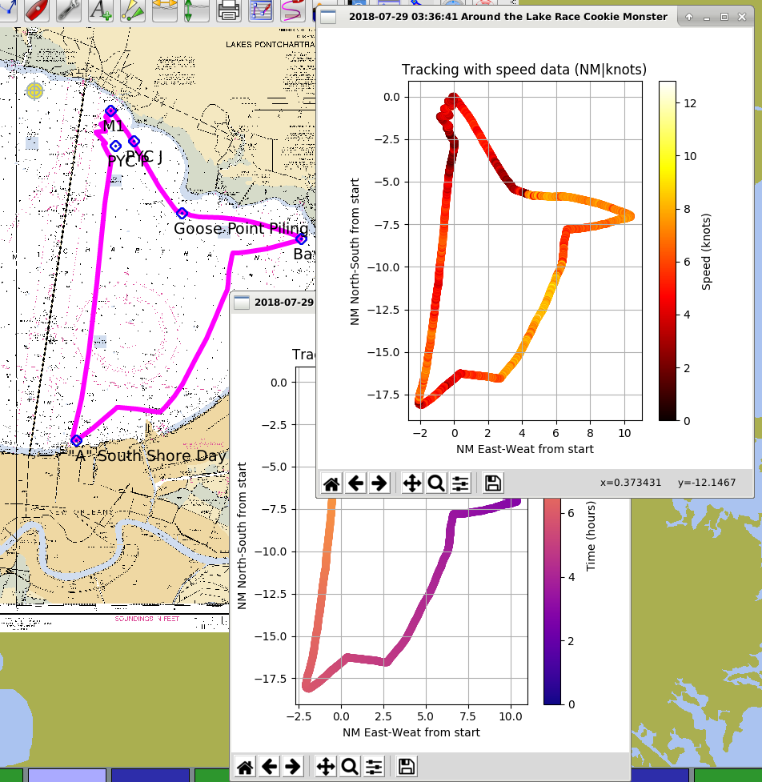

# Marine GPX Grapher
```
Name:     Gary Andrew Bezet
Site/Org: GarysCorner.NET
Email:    marinegpx@garyscorner.net
```

## Description
This program was originally intended to process tracking data from my Garmin Quatrix 3 marine watch.  You may see some references to "garmindata.py" in the git history this is because the originally intention was specifically for garmin export data, however when I learned more I realized the program should work with any standard GPX tracking data.

This program is designed to graph GPX tracking data for marine application.  I wrote it to get a more useful understanding of tracking data from regattas.  The basic problem is that tracking data doesn't tell a very good story without speed and/or time data.  While programs like OpenCPN are very useful I didn't find the display of tracking data was adequite.  To solve this I wrote this program which I intend to be used with a chart plotter like OpenCPN to provide additional data and allow you to form a good narrative about your last race.  If you look back at git revision history you may notice that I originally was writing this code to tear down the GPX data into a better format, but the project kept evolving and became what it is now.  Hope you find it useful.

### Screenshot
*Below:  Time and speeed graphs from marinegpxgrapher (this program) in the foreground with OpenCPN in the background (I did not write OpenCPN and have no affiliation with it, but you should still download it, its pretty cool*


### Files
- **2018-07-29 03_36_41 Around the Lake Race Cookie Monster.gpx**  GPX tracking data from a from a 10 hour race aboard S/V Cookie Monster, with 3686 points
- **marinegpxgrapher.py** The program written in python
- **SummerSeries2_2018-06-30 101554.gpx** GPX tracking data from a 1.5ish hour race aboard S/V Whiskers, with 716 data points
- **SummerSeries3_2018-07-14 12_16_21.gpx** GPX tracking data from a 2.5ish hour race aboard S/V Whiskers, with 1023 data points

*All GPX files are intended for testing purposes.  All three files were record on Lake Pontchartrain using a Garmin Quatix 3.*


## Installation
I use linux as play with data a lot so it just works on my computer.  Give me a while I'm going to look up basic install instruction for python, matplotlib, numpy and gtk for windows user.  Linux users make sure you have installed pip.  Then use pip to install numpy and matplotlib (gtk should be part of your system already).

## Status
I am uploading this early because someone asked for it.  I still have to write some direction for installation and remove some datastructures that were not used to cut down on RAM usage for large data sets.  While I expect this program to be very useful, and I may not put a ton of extra work into it unless there is some interrest.  This program is not as polished as I would like.  However I have learned that when it comes to writing free code if you tell yourself "I'll upload it when its perfect" then you won't ever upload it...  So here it is.

## Usage
Just run the program (marinegpxgrapher.py) using python (this usually just means double click it), but this depends on your system. The system will then process the files and show 3 graphs.  The 3 graphs may appear on top of each other so feel free to move them around.  The graphs appear in different windows since I expect the user to be comparing the data with a traditionall chart plotter like OpenCPN.

## Bugs
Please submit any bugs via Github.  If you have a file that doesnt work properly because of its size or something else please let me know and arrange to send me the file.  I have tested this code with a GPX file from a 10hour/48mile race consisting of over 3600 GPS points.  I suspect different devices record data at different rates so your dataset size may very.  Although matplotlib and numpy are designed to handle large amounts of data, there is a limit, and I'm not sure what that is (let me know if you find it)

## Sorries
Sorry about my spelling, also sorry I hacked this out soo quick as of the writing of this there are still parts of the datastructure like "latrad/lonrad" which no longer serve a function other than eating up ram, but Im working on it.  Also I plan on putting some direction for my Windows users who probably don't have python, and the libraries installed.  

## Warrenty
There is no warranty.  Like life, I make no guarantee.  This program should never be used for anything other than reviewing regattas, DO NOT, I repeat DO NOT use this program to assess man overboard situation in any way.
